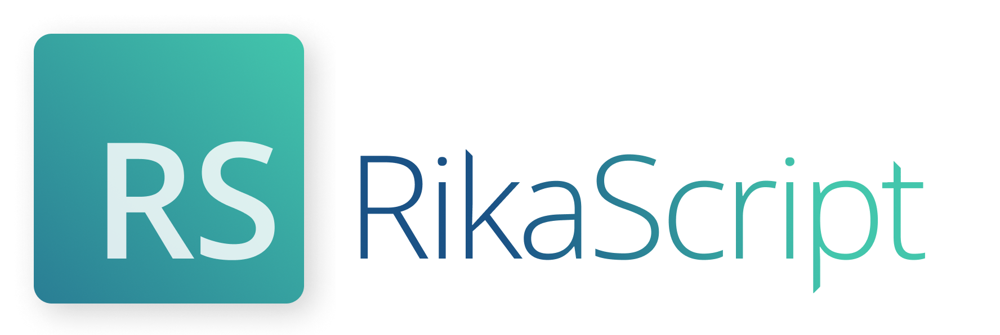
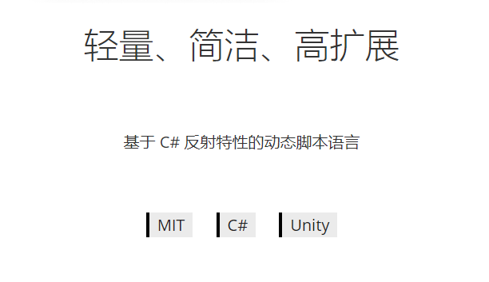

## 起步

快速创建一个 RikaScript 运行环境：

```c#
var rs = new Engine(new ConsoleLogger());
rs.Execute("log(Hello, World)");
```

运行即可在控制台看到 Hello, World。

快速构建一个 RikaScript 尝鲜环境：

```c#
var rs = new Engine(new ConsoleLogger());
while (true)
    rs.Execute(Console.ReadLine());
```

通过 RikaScript ，可以快速调用预先准备好的 C# 方法并进行简单的编程计算：

```scala
log("Hello, World")
// [INFO] Hello, World

add(1, 2, 3) > res
log("1+2+3 = ",@res)
// [INFO] 1+2+3 = 6

>=(1, 1) > res
log(@res)
// [INFO] True
```

## 数据类型

RikaScript 是弱类型的脚本语言，数据在 C# 运行环境中都保存为object类型，在执行函数时会转换成相应的数据类型。

```scala
// 正常的加法，结果是个double，转换成object并保存在res变量中
add(1, 2, 3) > res
// 出错，因为a不能转换成double
add(a, 123) > res
// 这个a就是字符串a，如果要引用变量需要在前面加上@
log(@res)
// [INFO] 6
```

## 流程控制

RikaScript 以方法定义代码段：

```scala
func Hello{
    // 如果字符串不包含特殊字符，可以省略""，这个Hello和上面func Hello 定义的Hello方法没有关系
	log(Hello)
}
```

定义好的方法会存在内存中，通过`call`关键字调用

```scala
call Hello
// [INFO] Hello
```

RikaScript 支持 if 和 while 语句，他们的代码体也是一个 func：

```scala
// 输出小于等于10的正偶数
func log_num{
	log(@loop10)
}
func loop10{
	mod(@loop10, 2) > mod_res
    // 判断是否被整除
    =(@mod_res, 0) > is_even
    if @is_even log_num
	add(@loop10, -1) > loop10
}
make(10) > loop10
// 当变量loop10为true或大于零时，循环loop10方法
while @loop10 loop10
// 变量名和方法名可以重名，也可以不重名，建议用方法名作为变量名控制循环
// [INFO] 10
// [INFO] 8
// [INFO] 6
// [INFO] 4
// [INFO] 2
```

> RikaScript 中，方法、变量、函数、类库，都存放在不同的字典中，所以他们之间可以重名

在 func 中，使用 if @xxx return 的方式退出当前方法，所以不建议将某个方法命名为 return ，叫做 return 方法不能被 if 调用

## 类库

每个 RikaScript 运行时都会自带上 std 类库，这个库在 C# 中对应的 class 是 RikaScript.Libs.StandardLib ，其中包含了 RikaScript 几乎必备的函数。

```scala
std.log(Woooooooo~)
// [INFO] Woooooooo~
```

如果要使用其他类库，可以在 C# 代码中对 Runtime 运行环境调用 AddLib 方法添加一个类库：

```c#
// C# 代码，实例化异步 RikaScript 执行引擎
var run = new AsyncEngine(new ConsoleLogger());
// 添加文件操作类库
run.Runtime.AddLib(new FileLib()); // 这里可以给类库一个别名，这个类库别名默认是 file
```

然后在 RikaScript 中通过别名调用（当然我没有改过别名）：

```scala
file.write(D:\test.txt, 'Wooooooo~')
// 然后你的磁盘可用空间就少了12字节
```

> 每个类库都会尽量提供一个help()方法用来显示帮助，例如 file 类库：
>
> ```scala
> file.help()
> ```
>
> ```
> FileLib:file - RikaScript 基本文件交互库
>          read(path) - 读取文件内容并返回
>          write(path, text) - 覆盖写入文件
>          append(path, text) - 追加写入文件
>          set_encoding(encoding) - 设定类库采用的文件编码，例如utf-8、gbk
>          set_new_line(str) - 指定追加文件时的前置符号，默认是换行符
> ```

如果不想在 C# 中导入类库，还可以在代码中使用 std 类库的 import 方法导入，这要求类库必须有一个可用的空参构造方法：

```scala
// 随机数类库作为例子，这个库的默认别名是random，嫌长就可以改成r来用
std.import(RikaScript.Libs.RandomLib, r)
r.range(0, 100) > res
std.log(@res)
[INFO] 12.5500561262248
```

运行时有一个默认类库属性，通过 std 类库的 set_default_lib 方法更改，默认值为 std ，修改默认类库可以让你的代码省略掉类名，就比如：

```python
log(这里是std的log方法)
write("D:\test.txt",这句话肯定报错，因为std类库没有write方法)
// [ERROR] [RikaScript.Exception.NotFoundMethodException] 找不到类库内部函数：write

set_default_lib(file)
write("D:\test.txt",这句话没有问题，因为现在的默认类库是 file)

// 想改回去记得在set_default_lib前面加上std.
std.set_default_lib(std)
log(操作完成！)
```

这也就是了为什么这个文档上面的代码都没加std前缀，因为默认类库一开始就是 std

## C# 代码架构介绍

### 运行环境

运行环境主要指 `Runtime`、`Engine`、`AsyncEngine` 这三个类

整个系统最核心的就是 Runtime 类，这个类实现了代码的逐行执行、变量报错、参数传递等工作，但它不能支持结构性的语句，比如func、if、call等，只能调用函数和保存变量，并且也不支持解析注释！

Engine 对 Runtime 进行一些包装，实现了复杂的语法，可以完整的执行上文介绍过的那些代码，解析注释也没问题。

AsyncEngine 继承自 Engine ，实现了异步执行，让 RikaScript 不干扰主线程任务。

### 扩展类库

RikaScript 的类库都要继承自 `ScriptLibBase` 类，这个父类会缓存反射获取的方法来提高运行速度，同时对外暴露一些统一的方法，顺便强制每一个类库都重写 help 方法来让使用者获取帮助。

ScriptLibBase 有个 LibName 关键字来设定类库的默认别名，有个可重写的OtherCall方法来处理那些特殊的函数名，比如std类库下那些符号命名的函数，其实是在OtherCall中通过switch实现的。

RikaScript 导入类库时，不论是通过在C#中AddLib还是 RikaScript 中 import ，实质上都是实例化了一个类库对象，因为可以通过 imprt 时指定别名来同时引入多个相同的类库。

基于 ScriptLibBase 扩展自己的函数时，对 RikaScript 开放的函数的函数名必须用小写字母或下划线开头，否则无法被 RikaScript 直接调用，需要注意 RikaScript 可直接调用的函数的返回值和参数类型必须都是 object，因此这些函数重载只能通过不同参数数量来实现，并且参数数量最大不能超过4个。

现在例如来扩展一个用于Unity的物体控制类

```c#
namespace RikaScript.Demo{
    class GameObjectLib:ScriptLibBase{
        private GameObject _go;
        
        public GameObjectLib():base("go","v0.0.1"){
            Info.AddInfo("set_go(name)","根据一个名字获取GameObject")
                .AddInfo("move(dir)","根据一个向量移动物体")
        }

        public void set_go(object goName){
            _go = GameObject.Find(goName.String());
        }

        public void move(object dir){
            _go.transform.Translate((Vector3)dir);
        }
    }
}
```

然后例如现在要控制两个物体移动：

```scala
import(RikaScript.Demo.GameObjectLib,go1)
go1.set_go(Cube1)
import(RikaScript.Demo.GameObjectLib,go2)
go2.set_go(Cube2)
// 这个向量变量需要再写扩展类来获取
go1.move(@xxx1)
go1.move(@xxx2)
```

### 日志输出

Runtime 类会用到 `LoggerBase` 类输出信息，继承 LoggerBase 来实现自己的输出，例如为 Unity 实现一个输出类：

```c#
using UnityEngine;
using RikaScript.Logger;

public class UnityLogger : LoggerBase
{
    public override void Print(object message) {
        Debug.Log(message);
    }

    public override void Info(object message) {
        Debug.Log(message);
    }

    public override void Warning(object message) {
        Debug.LogWarning(message);
    }

    public override void Error(object message) {
        Debug.LogError(message);
    }
}
```

然后在创建 RikaScript 时指定上这个类即可：

```c#
var rs = new Engine(new UnityLogger());
```

### 工具类

工具类是 `ScriptTools`，可以查看源码获得帮助

在扩展类库开发中，把 object 类型数据转换成基本数据类型的方法就写在了这个工具里

## RikaScript 语法总览


|语法|意义|
| ------ | ---- |
|func *name* {|开始定义名为 name 的方法|
|}|结束定义方法|
|call *func*|执行一个方法|
|if @*var* return|根据一个变量，判断是否停止当前方法或文件|
|if @*var* *func*|根据一个变量，判断是否执行一个方法|
|while @*var* *func*|根据一个变量，判断是否反复执行一个方法|
|exec *path*|执行一个 RikaScript 文件|
|echo *true\|false*|开启或关闭回显，默认false|

